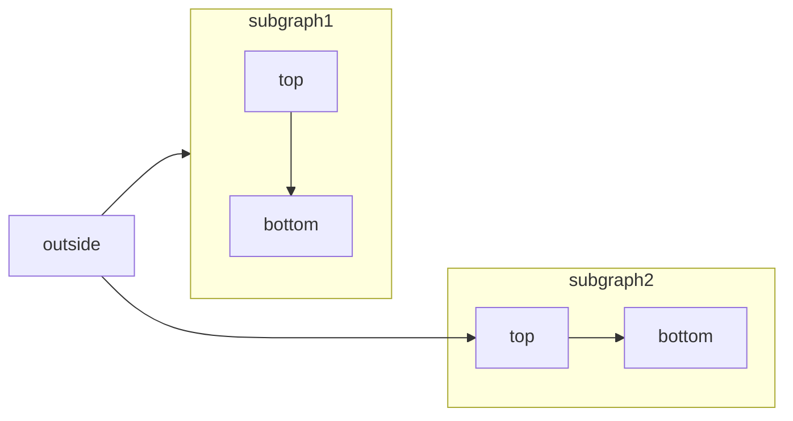

+++
title = 'B3 UMDF SBE Library'
date = 2023-09-22T20:58:50-03:00
+++

# Intordução 

A B3 irá disponibilizar uma nova interface de publicação do Market Data Feed (UMDF) utilizado um novo protocolo
chamado SBE (Simple Binary Encoding) para substituir o FIX/FAST. Com isso surgiu a necessidade de desenvolver uma 
nova biblioteca para decodificar as mensagens, substituíndo nosso finado QuickFast, assim como a oportunidade da
criação de uma nova biblioteca de UMDF para alta performace alta performance. Neste artigo irei descrever a arquitetura
e o funcionamento desta nova biblioteca.

## 1. Arquitetura 

```goat
                                                Intelitrader UMDF B3 SBE Library
                    .----------------------------------------------------------------------------------------------------. 
                    |                                                                                                    |
                    |                                                                                                    |
                    |                                                                                                    |
                    |   socket UDP                    queue lock-free                                                    |
                    |  .---------.                    .----------.                                                       |
  buffer input      |  |         |                    |   .---.  |                                                       |
      B3  ----------|->|in    out+--------------+     |   |   +  |                                                       |
                    |  |         |              |     |   +---+  |                                                       |
                    |  '---------'              |     |   |   |  |                                                       |
                    |       ^                   |     |   +---+  |                                                       |
                    |       |                   |     |   |   |  |                                                       |
                    |       +----------------+  |  inA|   +---+  |                                                       |
                    |  .---------.           |  +-----+-> |   |  |                                                       |
                    |  |         |           |     inB|   +---+  |                                      UMDF             |
              B3  --|->|in    out+-----------|--------+-> |   +  |                                  State Machine        |
                    |  |         |           |        |   +---+  |                                 .-------------.       |
                    |  '---------'           |        |   |   |  |                                 |             |       |
                    |       ^                |        |   +---+  | out                             |             |       |  User Output
                    |       | start/stop     |        |   |   +--+-------------------------------->| in    iout  +-------|------>>
                    |       +--------+       |        |   +---+  |                            +--->| srn  srnout +-------|------>>
                    |                |       |        |   |   +  |                            | +->| sdn  sdnout +-------|------>>                  
                    |                |       |        |   +---+  |                            | |  |             |       |
                    |                |       |        |   |   +  |                            | |  |             |       |
                    |                |       |        |   '---'  |                            | |  | notify      |       |
                    |                |       |        '----------'                            | |  '----+--------'       |
                    |                |       |                                                | |       |                |
                    |  socket UDP    +-------+-------------------+                            | |       |                |
                    |  .---------.                               |                            | |       v                |
                    |  |         |                               |                            | |  .-------.             |
              B3  --|->|in    out+-------------------------------|----------------------------+ |  |    in |             |
                    |  |         |                               |                              |  |       | notify      |
                    |  '---------'                               |                              |  |  out  | manager     |
                    |      ^                                     |                              |  '-+--+--'             |
                    |      | start/stop                          |                              |    |  |                |
                    |      +-------------------------------------+-----------------------------------+  |                |
                    |   socket UDP                                                              |       |                |
                    |  .---------.                                                              |       |                |
                    |  |         |                                                              |       |                |
              B3  --|->|in    out+--------------------------------------------------------------+       |                |
                    |  |         |                                                                      |                |
                    |  '---------'                                                                      |                |
                    |      ^                                                                            |                |
                    |      | start/stop                                                                 |                |
                    |      +----------------------------------------------------------------------------+                |
                    '----------------------------------------------------------------------------------------------------'
```
Acima temos um desenho da arquitetura geral do biblioteca com foco no fluxo de dados desde a chegada do buffer entregue pela B3 em um sinal multicast até a entrega da mensagem
para o usuário da API após decodificar e validar a mensagem, cada  caixinha representa uma classe ou um modulo onde existe uma entrada e uma saída os sinais de input da B3 podem ser recebidos
em paralelo. Em seguida podemos encontrar a descrição básica do funcionamento de cada modulo.

### 1.1 Socket UDP

Esta é uma classe implementada utilizando Boost Asio com o objetivo bem definido de se conectar ao sinal multicast receber as mensagens e emcapsular elas dentro de um buffer interno, este buffer interno
contém alem do buffer recebido pela B3 um timestamp com resoluçao em nanosegundos informando o horario de recebimento da mensagem assim como sua fonte. 
in: Buffer UDP com um tamanho máximo de 1400 Bytes. No caso do UMDF SBE da B3 seguindo a documentação teremos 4 sockets, um para receber o security definition, um segundo para o recebimento do snapshot recovery e
mais dois para o incremental sendo um uma redundância.

**Descriçao:**

**out:** Internal Buffer.\
**start:** chamado automaticamente na criação do socket.\
**stop:** finaliza o socket.

### 1.2  Queue Lock-Free

Esta é uma fila circular onde tanto a inserção como a reção pode ser feita por multiplas threads ao mesmo tempo sem a necessidade da utilização de mutex. Existem muitas bibliotecas prontas que utilizam este conceito,
contudo o que foi utilizado aqui é uma versão customizada, pois a maioria das bibliotecas deste tipo quando a fila está lotada o produtor deve esperar o consumidor consumir pelo menos uma mensagem para liberar espaço
no buffer para aí sim o produtor inserir a nova mensagem, contudo como o foco da biblioteca UMDF SBE é focada em alta performance, foi utilizado um conceito mais simples caso a fila fique cheia. Na nossa versão
de ring buffer,caso uma fila fique cheia o produtor irá sobreescrever a mensagem não consumida, o que irá gerar uma perda de mensagem, caso isso ocorra devemos entender que a biblioteca está lenta e este GAP, fará todo 
o sistema reiniciar (fazer o snapshot e começar novamente o incrmental) para remover este atraso, outra vantagem disso é que a implementação se torna mais simples tanto na hora de publicar uma mensagem quanto na hora de consumir.
Utilizamos este ring-buffer somente para o incremental pois devido receber mensagens redudantes  por dois sockets  precisamos serializar o processamento dos dois canais afim de remover mensagens repetidas do fluxo.

Descriçao:

**inA:** Internal Buffer proveniente do incremental feed A\
**inB:** Internal Buffer proveniente do incremental feed B\
**out:** Internal Buffer.


### 1.3 UMDF CPU




### 1.4 Notification Center

asdfsdfsdf
dsdfadfsf
adfadfadfadfaaaa

# 2. Gerenciamento de Memória

# 3. Perfomance

# 4. SBE Encoder/Decoder

# 5. Considerações Finais