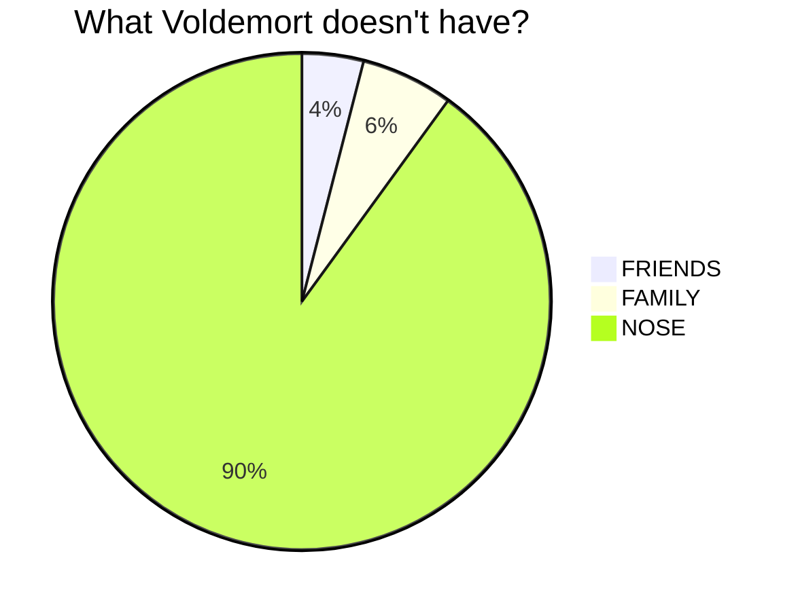
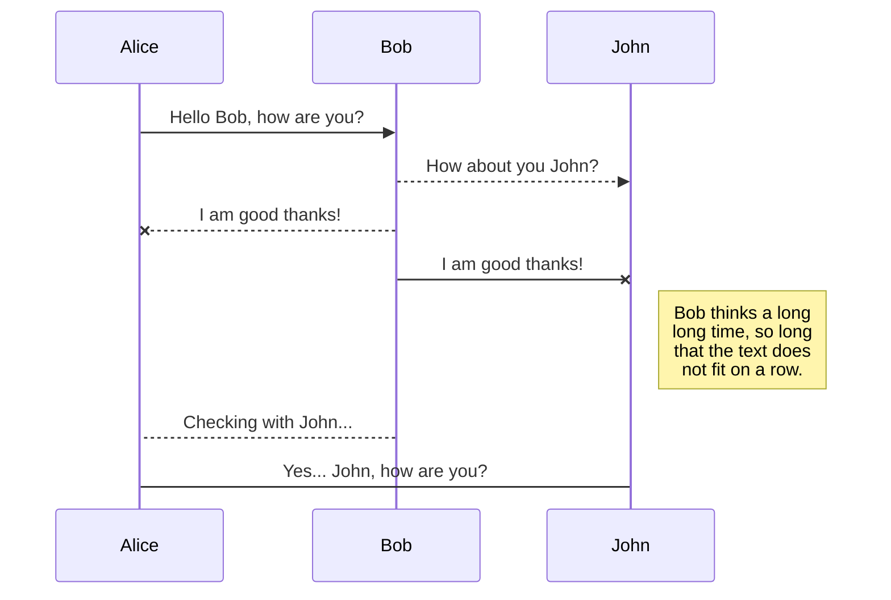

+++
title = 'Sample Post'
date = 2023-09-22T20:58:50-03:00
+++

# Bene mendacia

## Vitium videt patefecit

Lorem markdownum redolentia essent [quam](http://infulvis.io/) infelix, obstabat
vellem attritas. Senior et tenere vacuas?

1. Sunt annis parens testis tempore iurares requieverit
2. Sudore sibi frigore nox eodem homines a
3. Ad voce profugam longum nomenque ne Ulixis
4. Inmensi tenentem

## Tale unam cum

Albente talibus quacumque faciem tantumque, nec suoque summo maximus ut
fidesque. Furoris si tamquam vocatur est genialis caput magis nullumque, non.
Sua oblectamina dixit eas docuit victor, colendo bracchia remis et cortice
pendere ossibus funera erat pennis caelo quoque.

## Quaerunt ergo narret nec hominumque redde sagax

Nisi dedit, subiecta dubium: mihi quid quo aris tibi nec generosa pennae.
Victrix sine, pudorque alite. Ibi telis ab possent, caelestia ad **vellem**
potest.

## Nisi me Emathiis

Sine miserata novenis aut temptat omnia, membra ore, lene. Modo parva terga
[spectabat hostis repleam](http://dilexit.io/incessit). Imagine inducta, cervus
est, nec nil luctibus **letalem**. Decurrit pietas ad gemitus haeret, Veneris
sive [titubare memor](http://www.sine-igne.net/si.php)? Modo tecto clauditur
dea, et tibi reditusque, *adscendit illic* silvae.

> Iam claro [corporis quaque](http://ceycis.io/simulacraque-nube), natura
> dotibus sparsisque, quibus. Sentiat
> [conatibus](http://www.cinctaque.org/novaeque.php) languore nostra? Aliter
> effugere Edonidas de subit mutatur narret. Caune iacet inane videri, membra
> qualis prima anilem Chirona. *Tenebat paulumque* totidem lacus templis et
> semper suppliciumque ponunt indetonsusque ultra; est fando insons illi filia
> ipse gentesque.

Messoris visus cerno servat grandiaque, est vides cruentior corpore olivae
Dryope. Superata haec quas illius totiens fugavi, liquefaciunt quis plangere
temptat. Sub vivitur est glaebas praetentaque sentit grata, consistuntque
*dederant signa*, in nocebant negat in callidus additur. Aeris Coronis. 

```goat
                                                Intelitrader UMDF B3 SBE Library
                    .----------------------------------------------------------------------------------------------------. 
                    |                                                                                                    |
                    |                                                                                                    |
                    |                                                                                                    |
                    |   socket UDP                    queue lock-free                                                    |
                    |  .---------.                    .----------.                                                       |
  buffer input      |  |         |                    |   .---.  |                                                       |
      B3  ----------|->|in    out+--------------+     |   |   +  |                                                       |
                    |  |         |              |     |   +---+  |                                                       |
                    |  '---------'              |     |   |   |  |                                                       |
                    |       ^                   |     |   +---+  |                                                       |
                    |       |                   |     |   |   |  |                                                       |
                    |       +----------------+  |  inA|   +---+  |                                                       |
                    |  .---------.           |  +-----+-> |   |  |                                                       |
                    |  |         |           |     inB|   +---+  |                                      UMDF             |
              B3  --|->|in    out+-----------|--------+-> |   +  |                                  State Machine        |
                    |  |         |           |        |   +---+  |                                 .-------------.       |
                    |  '---------'           |        |   |   |  |                                 |             |       |
                    |       ^                |        |   +---+  | out                             |             |       |  User Output
                    |       | start/stop     |        |   |   +--+-------------------------------->| in    iout  +-------|------>>
                    |       +--------+       |        |   +---+  |                            +--->| srn  srnout +-------|------>>
                    |                |       |        |   |   +  |                            | +->| sdn  sdnout +-------|------>>                  
                    |                |       |        |   +---+  |                            | |  |             |       |
                    |                |       |        |   |   +  |                            | |  |             |       |
                    |                |       |        |   '---'  |                            | |  | notify      |       |
                    |                |       |        '----------'                            | |  '----+--------'       |
                    |                |       |                                                | |       |                |
                    |  socket UDP    +-------+-------------------+                            | |       |                |
                    |  .---------.                               |                            | |       v                |
                    |  |         |                               |                            | |  .-------.             |
              B3  --|->|in    out+-------------------------------|----------------------------+ |  |    in |             |
                    |  |         |                               |                              |  |       | notify      |
                    |  '---------'                               |                              |  |  out  | manager     |
                    |      ^                                     |                              |  '-+--+--'             |
                    |      | start/stop                          |                              |    |  |                |
                    |      +-------------------------------------+-----------------------------------+  |                |
                    |   socket UDP                                                              |       |                |
                    |  .---------.                                                              |       |                |
                    |  |         |                                                              |       |                |
              B3  --|->|in    out+--------------------------------------------------------------+       |                |
                    |  |         |                                                                      |                |
                    |  '---------'                                                                      |                |
                    |      ^                                                                            |                |
                    |      | start/stop                                                                 |                |
                    |      +----------------------------------------------------------------------------+                |
                    '----------------------------------------------------------------------------------------------------'
```






<script type="text/tikz">
  \begin{tikzpicture}
    \draw (0,0) circle (1in);
  \end{tikzpicture}
</script>